# IoT Shed

The IoT Shed is a project focused on adding automation to an ordinary shed. The project includes remote light control, cooling the inside of the shed, and a website to control and monitor information remotely. My goal for this project was to help my dad automate some tasks in his shed while using skills that I learned from a course I recently took at Arizona State University, Programming for the Internet of Things.

This repository includes everything needed to make this project on your own. Please feel free to fork the code and schematics and make your own version. If you do, then please share your final version with me! I'd love to see how you improved upon my design for your own shed. I included a [future work](#future-work) section to provide some ideas.

___
## About this document
This document has two sections - a section giving an [overview](#overview) of how everything works and a section that provides a [step-by-step guide](#step-by-step-guide) for replicating this project on your own.

___
## Table of Contents
[Overview](#overview)
- [Website](#website)
- [Light Control](#light-control)
- [Shed Cooling](#fan-cooling)
- [Ceiling Control](#ceiling-control)
- [Battery Monitoring](#battery-monitoring)

[Step-by-Step Guide](#step-by-step-guide)
- [Components](#components)
- [Circuit](#circuit)
- [Code]()
- [Enclosure](#enclosure)
- [Bill of Materials](#bill-of-materials)
- [Future Work](#future-work)
- [Acknowledgements](#acknowledgments)

___
## Overview
This section shows a high level view of how everything in the IoT shed works. Please refer to the [Step-by-Step Guide](#step-by-step-guide) for instructions on how to make the project yourself.

This [video](https://www.youtube.com/watch?v=PkzvmJoyXTg) shows a demonstration with everything working.

### Website
The website is broken into four sections: ceiling slits, battery level, occupancy, and the temperature. The ceiling slits section is for monitoring the state of the ceiling slits, whether rain has been detected or not, and the status of the air compressor and releae valve. The battery level section is meant to indicate the current charge on the battery. The occupancy section is for monitoring if someone is currently in the shed or not. This will determine the status of the lights. The temperature section is for monitoring the indoor and outdoor temperatures as well as the state of the fan.

The ESP32 Relay Board will serve as a server that hosts the website. Anyone connected to the same WiFi can access the website. A simple concept visual is shown below.

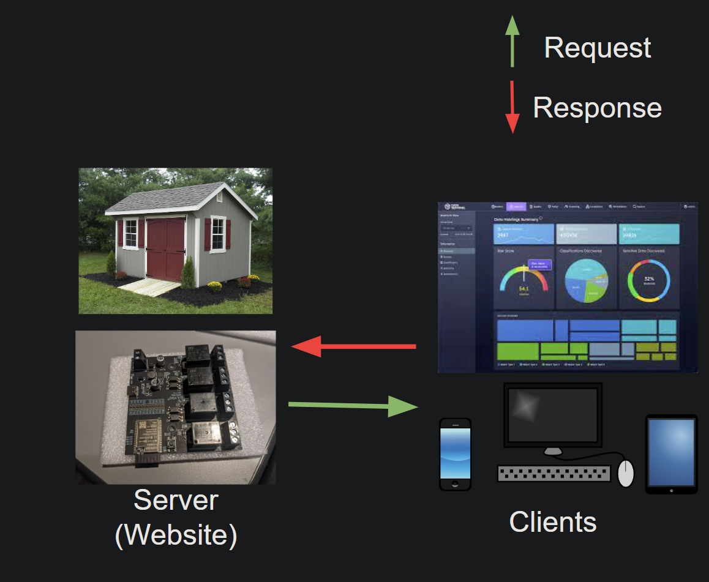

Users can toggle the air compressor, release valve, fan, and lights using the website. The status of each will automatically update on the website. These toggle buttons were included mainly for testing, but I kept them so users can still have access to them. However, the goal of this project is to automate processes, so the buttons are not meant to be used often. 

### Light Control
My original intention was to automate the shed lights so that they turned on when someone entered, stayed on as long as someone was moving in the shed, and turned off when no one occupied the shed. Because of my limited time, I have not completed this section yet. The device I plan to use is called a Passive Infrared (PIR) sensor. More details on this sensor can be found in the [components](#components) section in the [step-by-step guide](#step-by-step-guide). For now, users can toggle the lights remotely using the website. I intend on completing this section soon. The LED strips are shown below.

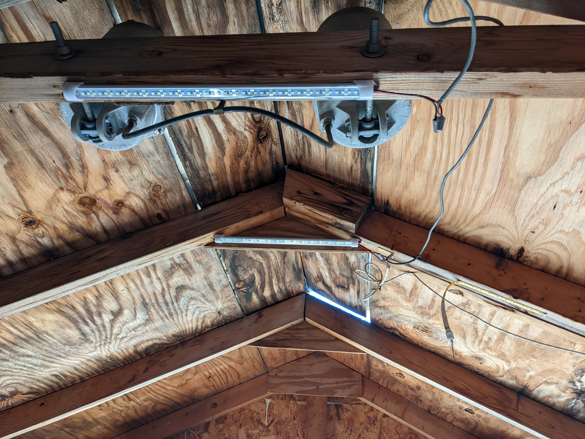

### Shed Cooling
My home in Texas gets very hot. Throughout most of the year, the temperature inside my dad's shed is much hotter than it is outside. My dad's shed currently uses a fan and pneumatic actuators to open and close ceiling slits to cool down the shed. Before this project, both of these were controlled with switches. Now, both are controlled automatically using sensors. The image below shows the pneumatic actuators and the ceiling slits when they're closed.

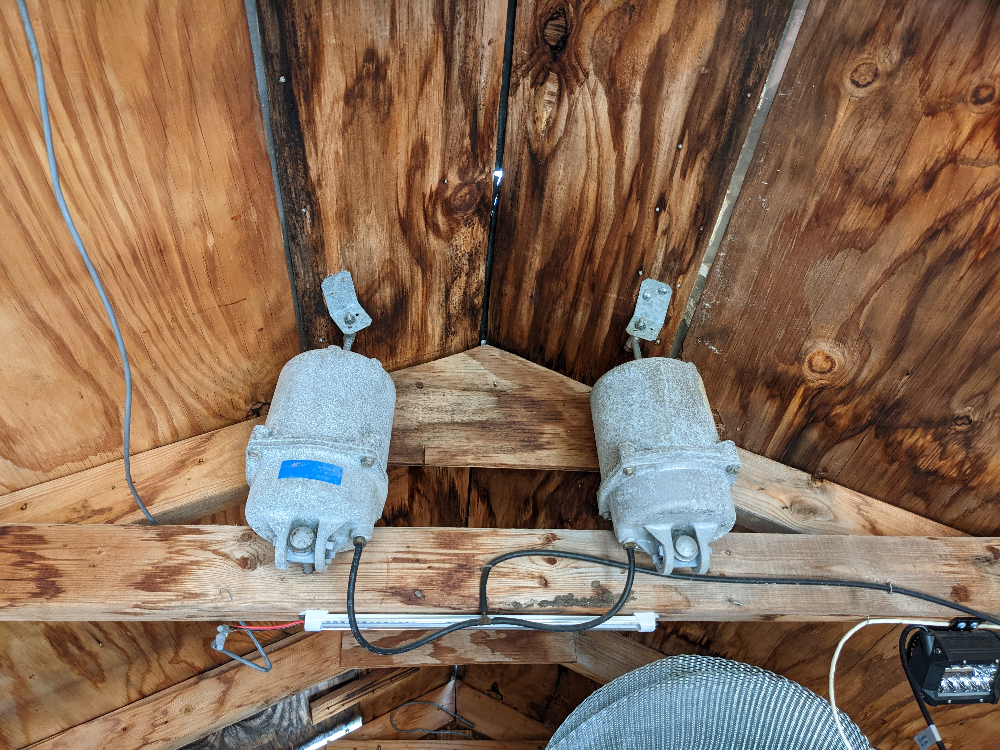

When the outside temperature rises 5&#176;F above the temperature inside the shed, the air compressor will turn on. The compressor will actuate the two pneumatic actuators installed just below the ceiling slits and open them. The process takes about twenty five seconds then the air compressor shuts off. As long as the ceiling slits are open, the air compressor will not turn on again regardless of the temperature differential. The ceiling slit status is determined by the limit switch installed just below one of the ceiling slits. The indoor and outdoor temperature sensors are shown below. The images below show what the ceiling slits look like when they're open.

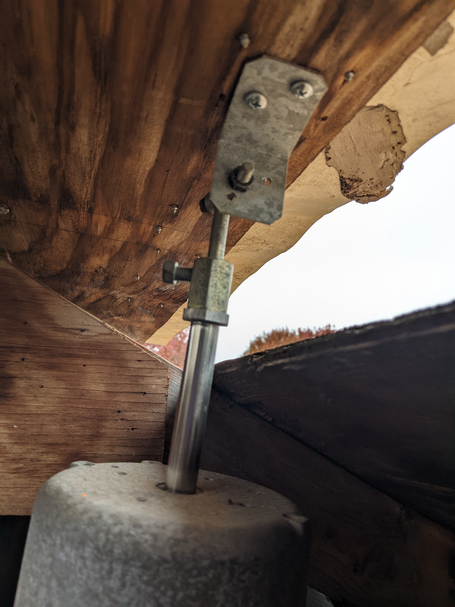
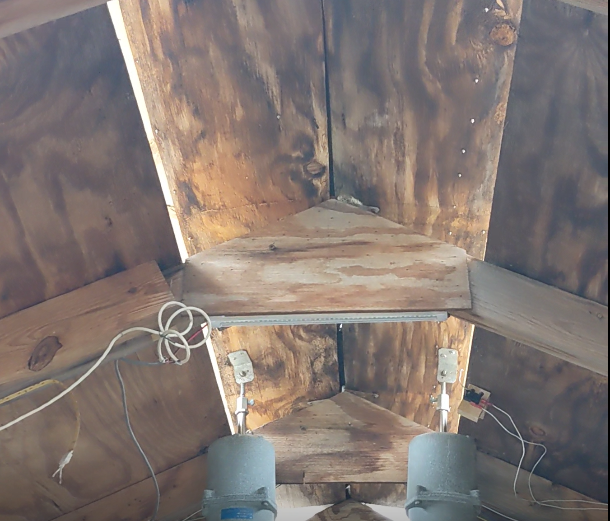

When the same temperature differential happens, the fan will turn on for a specific amount of time then pause for a different amount of time. This is meant to prevent the fan from running all day and draining the battery. The fan will help cool down the shed a little and keep air flowing, but it will not cool the shed down enough to change the temperature differential, which is why the fan should be paused after being used.

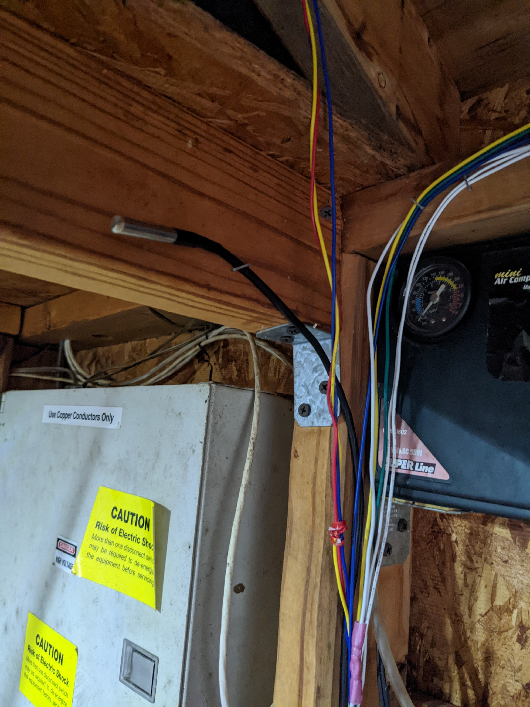
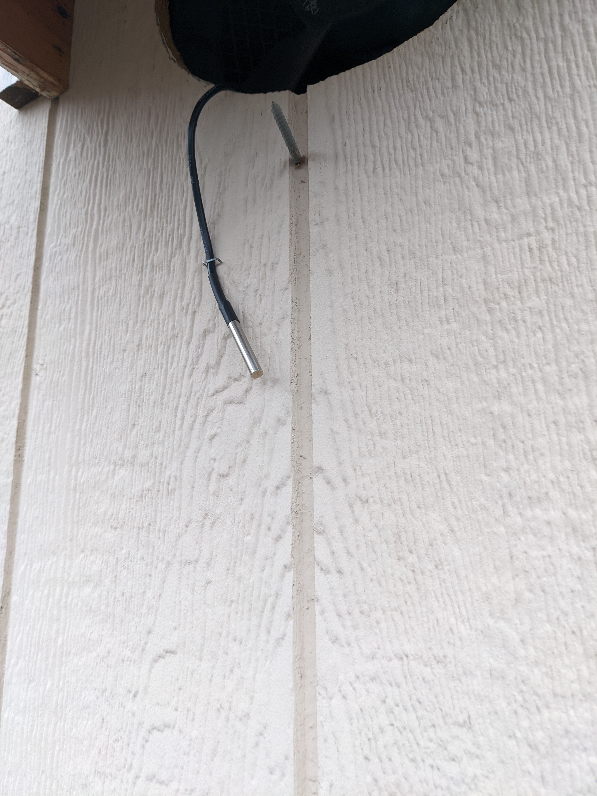

### Ceiling Control
As explained in the previous section, the ceiling slits are opening using an air compressor. When rain is detected by the rain sensor, the same slits are closed using a release valve. The processor for closing the slits is about ten seconds.

There is a pneumatic system made up of pipes used to control the air flow into and out of the pnemuatic actuators. An image of what I used is shown below. However, this is not necessary. All that is needed is the tubing shown in the bill of materials. This is for connecting the air compressor and the release valve to the pneumatic actuators.

### Battery Monitoring
My original intention was to show the current charge on the battery using the website. If the charge on the battery dropped below a set value, then an email would be sent to the user to charge the battery. Because of my limited time, I have not completed this section yet. The device I plan to use is an ina260 power sensor from Adafruit. More details on this sensor can be found in the [components](#components) section in the [step-by-step guide](#step-by-step-guide). For now, users can see where the battery charge will be located when this part is complete. The battery sensor I intend on using is shown below.

___
## Step-by-Step Guide
This section is a step-by-step guide for replicating the IoT Shed project. Please refer to the [Overview](#overview) for a high level view of how everything in the IoT shed works. 

### Components
Please begin the project by ordering all the components found in the [bill of materials](#bill-of-materials) section. It is assumed you already have a shed and a laptop to program. 

I highly recommend testing each component and circuit individually to make sure everything works the way it's intended. This will also give you some familiarity with everything at the start. More information for each sensor can be found on the website links found in the [bill of materials](#bill-of-materials) section. Each component shown below has a link to a brief tutorial showing you how to use them and a simple circuit for testing.
- [PIR Sensor](https://learn.adafruit.com/pir-passive-infrared-proximity-motion-sensor/overview)
- [Power Sensor](https://learn.adafruit.com/adafruit-ina260-current-voltage-power-sensor-breakout)
- [Temperature sensor](https://www.adafruit.com/product/381)
- [Limit Switch](https://youtu.be/6wuInF9Yw08)
- [Rain sensor](https://www.kemo-electronic.de/en/House/Garden/M152-Rain-Sensor-12-V-DC.php)

Please note that the TTGO T-U2T USB to TTL device found in the [bill of materials](#bill-of-materials) is required to program the ESP32 Relay Board. 

The limit switch needs a way to stay fixed under the ceiling slits so it can turn on and off when the slits are open and closed. The image below shows how I solved this issue. 

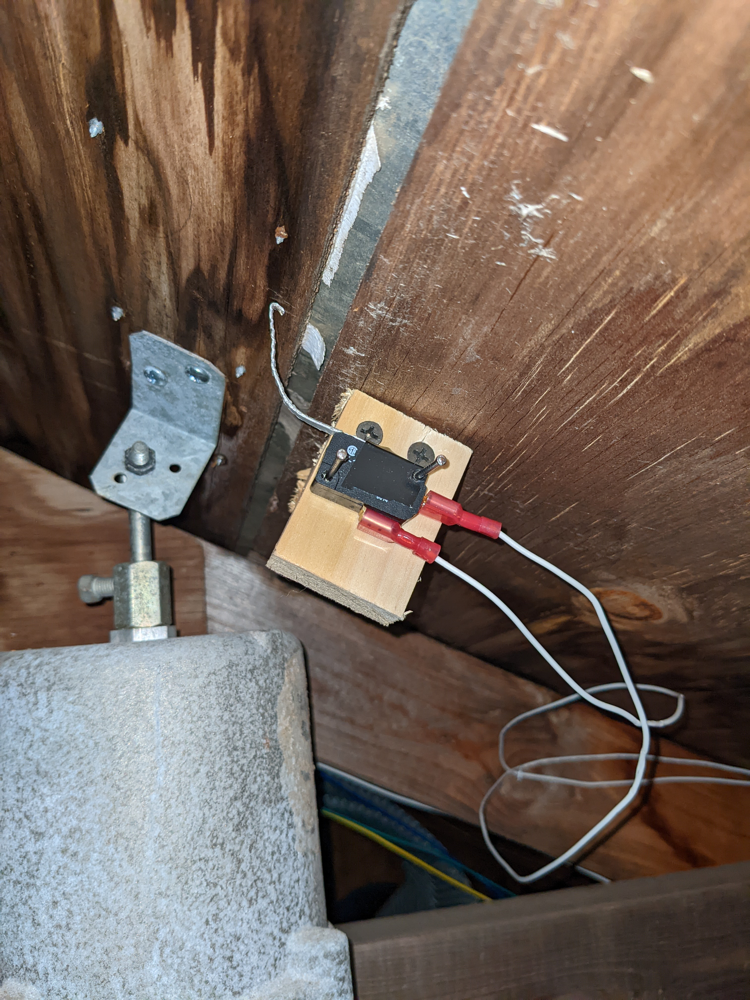

This device is made up of two 2"x4" blocks, four wood screws, two nails, and a thin piece of sheet metal to extend the limit switch lever. All of these materials are in the bill of materials. Screw the two blocks at a right angle and to a fixed part of the shed ceiling. Use two nails to fix the limit switch. Cut and glue a thin metal strip to the limit switch. Use two spade connectors to electrically connect to the limit switch.

The rain sensor needs to be placed at an angle so water will runoff of it and not collect onto the surface. All of the materials shown are in the bill of materials. Four screws were driven into the metal bracket and shed wall. The rain sensor was secured using metal wire. Test that water will run off the roof onto the sensor before permenantly installing.

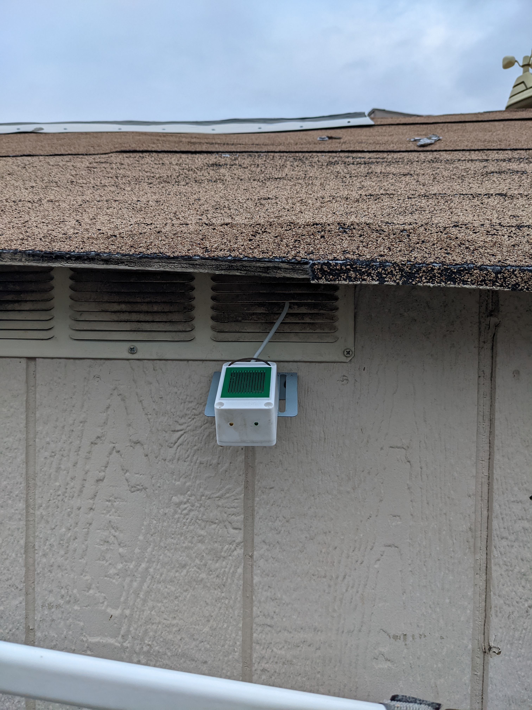

### Circuit
When I began this project, I planned on getting all power from the 12V DC car battery already powering other devices in the shed. To prevent damage to components, I decided to use a buck regulator between the battery power and everything I planned to power. This regulator restricted the current to a maximum of 1 Amp. Please keep in mind the maximum allowable current for each device you plan on using.

The system's circuit is shown below. Note that the accessible GPIO pins have been placed on the top and bottom of the ESP32 relay board for readability. Also, the pull-up resistors shown are all 4.7k Ohm. Please note that the PIR sensor and the power sensors are not yet included in the final circuit.

The red lines indicate power wries, the black lines indicate ground wires, and the blue lines show the signal wires. Please make sure each component is powered and grounded appropriately. Once you have all of the components and tested each one, please assemble the circuit shown above. Note that the length of each wire will depend on how far each component will be placed in the shed relative to the ESP32 Relay Board.

The air compressor, the fan, the release valve, and the led strip are all controlled by the relays because they operate on a much higher voltage than the ESP32 relay board can provide. The other components can be powered using the battery or the 3.3V from the ESP32 relay board. 

When rain is detected, the rain sensor provides a 12V signal. This high voltage signal would destroy the ESP32 relay board if it was plugged directly into one of the GPIO pins. An optocoupler is used as an intermediate so that a 3.3V logic signal is sent to the ESP32 Relay Board when rain is detected.

### Code
There are four files of code: main.ino, index.html, style.css, and script.js. All of these can be found in the src folder in this repository. They are managed on the ESP32 relay board using SPIFFS. The main.ino file is the code for the server, sensor logic, and data transmission. The remaining three files all make up the website design and functionality. 

First, download the following libraries to your computer:
- [AsyncTCP](https://github.com/me-no-dev/AsyncTCP)
- [ESPAsyncWebServer
](https://github.com/me-no-dev/ESPAsyncWebServer)

Using the Arduino IDE, add the above libraries as well as these:
- WiFi.h
- Wire.h
- OneWire.h
- DallasTemperature.h

Next, install SPIFSS using this [tutorial](https://youtu.be/mkXsmCgvy0k). Please watch from 1:54 to 2:43.

Save the main.ino file into a folder labeled "main". Within the main folder, create a new folder labeled "data". Save the HTML, CSS, and Javascript files in this folder. Back in your Arduino IDE, click on "tools", then click on "ESP32 Sketch Data Upload". This will load the files in the data folder for the website. 

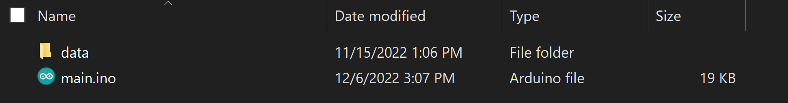
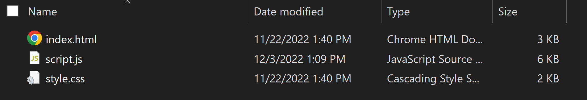

The next step is to get the wifi information needed to make a static IP address. In the main.ino file, Write in your wifi's SSID and password into the ssid and password variables at the top of the file. Run the program and open the serial monitor. You may need to press the reset button on the ESP32 Relay Board. After the program finishes connecting, the IP Address, Subnet Mask, Gateway IP, and DNS IP will be displayed. Please copy this information to the same variables at the top of the connectToWifiStatic() function. Copy the IP Address and rewrite it into the first line found in the script.js file.

Now, switch the program so it connects the static IP Address you recorded everytime you reset the program. Navigate to the setup function, uncomment the connectToWifiStatic() function, and comment the connectToWifi() function. Save each file, click on "tools", then click on "ESP32 Sketch Data Upload" to update the website information. Run the main.ino file in the Arduino IDE. Open the serial monitor to make sure the ESP32 Relay Board connects correctly. Open a brower and type in the static IP Address shown in the serial monitor. You should see the website pop up with correct sensor information. 

### Enclosure
The enclosure of the relay board is made out of acrylic and cut using a laser cutter provided by the Fab Lab at Arizona State University. The enclosure file, labeled board_enclosure.pdf, can be found in the additional_documentation folder in this repository.

The circuitry is currently not enclosed and exposed to the elements. I plan on making another enclosure for this in the near future.

### Bill of Materials
| Item | Price |
| ---- | ----  |
| [Battery](https://www.walmart.com/ip/EverStart-Value-Lead-Acid-Automotive-Battery-Group-Size-26-12-Volt-525-CCA/482504063?wmlspartner=wlpa&selectedSellerId=0&wl13=2515&adid=22222222277482504063_117755028669_12420145346&wmlspartner=wmtlabs&wl0=&wl1=g&wl2=c&wl3=501107745824&wl4=pla-294505072980&wl5=9060377&wl6=&wl7=&wl8=&wl9=pla&wl10=8175035&wl11=local&wl12=482504063&wl13=2515&veh=sem_LIA&gclid=CjwKCAiA9qKbBhAzEiwAS4yeDbAxHoxaAYIXZ1iEBbvH7YLKysCqkxCNjpezNFZtTs6tq_nxSTrQ8BoC20UQAvD_BwE&gclsrc=aw.ds) | $60 |
| [Wire Strippers](https://www.amazon.com/Klein-Tools-Cutter-Stripper-Stranded/dp/B00080DPNQ/ref=sr_1_7?crid=2NRR7LBD7TSQ8&keywords=wire+stripper&qid=1670365592&s=industrial&sprefix=wire+stripper%2Cindustrial%2C123&sr=1-7) | $20 |
| [Spade Connectors](https://www.amazon.com/TICONN-Disconnect-Connectors-Electrical-Assortment/dp/B08BZ8BLJN/ref=sr_1_5?crid=4FGESIFJVHCX&keywords=wire+connectors&qid=1670365634&s=industrial&sprefix=wire+connectors%2Cindustrial%2C168&sr=1-5) | $20 |
| [Wire Connectors & Crimpers](https://www.amazon.com/haisstronica-Connectors-Electrical-Waterproof-Removable/dp/B09GLKX7ZX/ref=sr_1_17_sspa?keywords=butt+connectors+crimp&qid=1670367460&s=industrial&sprefix=butt+connector%2Cindustrial%2C142&sr=1-17-spons&psc=1&spLa=ZW5jcnlwdGVkUXVhbGlmaWVyPUExWTRQOTdXUDYyRTVXJmVuY3J5cHRlZElkPUEwOTUwODMxVVFIVUZXR0Y0OVpQJmVuY3J5cHRlZEFkSWQ9QTA4ODU3MzBIWUhDSFU5WDEwT1Ymd2lkZ2V0TmFtZT1zcF9tdGYmYWN0aW9uPWNsaWNrUmVkaXJlY3QmZG9Ob3RMb2dDbGljaz10cnVl) | $55 |
| [Wood Screws](https://www.amazon.com/HongWay-Phillips-Assortment-Tapping-Drywall/dp/B08CZJK8SW/ref=sr_1_1_sspa?crid=1KCK4M591MWRL&keywords=assortment+of+wood+screws&qid=1670365757&s=industrial&sprefix=assortment+of+woodscrews%2Cindustrial%2C120&sr=1-1-spons&psc=1&spLa=ZW5jcnlwdGVkUXVhbGlmaWVyPUFONUFDMDE1MUJCRkwmZW5jcnlwdGVkSWQ9QTA2NTE0NzQyM0YyNkVPQU1HVjkxJmVuY3J5cHRlZEFkSWQ9QTA1MzA1MzcySUZZTjNCMDRMVEJCJndpZGdldE5hbWU9c3BfYXRmJmFjdGlvbj1jbGlja1JlZGlyZWN0JmRvTm90TG9nQ2xpY2s9dHJ1ZQ==) | $8 |
| [Wood Nails](https://www.amazon.com/Premium-Hardware-Assortment-Maximum-Galvanized/dp/B089FLMFPB/ref=sr_1_4?crid=3BZGRNXBZ7HHZ&keywords=assortment+of+wood+nails&qid=1670365787&s=industrial&sprefix=assortment+of+wood+nails%2Cindustrial%2C144&sr=1-4) | $7 |
| [Drill](https://www.amazon.com/BLACK-DECKER-Cordless-Driver-BDCDD12C/dp/B0111N8L7I/ref=sr_1_7?crid=22TRCF527S90C&keywords=drill&qid=1670365810&s=industrial&sprefix=drill%2Cindustrial%2C148&sr=1-7) | $30 |
| [Breadboard & Jumper Wires](https://www.amazon.com/BOJACK-Values-Solderless-Breadboard-Flexible/dp/B08Y59P6D1/ref=sr_1_2_sspa?crid=JW61U1DS0Z8&keywords=breadboard&qid=1670365842&s=industrial&sprefix=breadbor%2Cindustrial%2C124&sr=1-2-spons&psc=1&spLa=ZW5jcnlwdGVkUXVhbGlmaWVyPUEyVTJEUlZYUzQ5UzFNJmVuY3J5cHRlZElkPUEwMDA1MDk5MkhCWTFTS05JVTc3QSZlbmNyeXB0ZWRBZElkPUEwMjc0NTcxMU9CWEdDSkpST1ZYQyZ3aWRnZXROYW1lPXNwX2F0ZiZhY3Rpb249Y2xpY2tSZWRpcmVjdCZkb05vdExvZ0NsaWNrPXRydWU=) | $12 |
| [Soldering Kit](https://www.amazon.com/Soldering-Kit-Temperature-Desoldering-Electronics/dp/B07GTGGLXN/ref=sr_1_4?crid=1T7MZMVHEUWXS&keywords=soldering+kit+with+solder&qid=1670365891&s=industrial&sprefix=soldering+kit+with+solde%2Cindustrial%2C130&sr=1-4) | $20 |
| [Limit Switch](https://www.amazon.com/REDGOOSE-Switch-Normally-3X10PCS-Switches/dp/B0B7DD5SF1/ref=sr_1_26?crid=1M40M2A8C7KPZ&keywords=limit+switch&qid=1670365952&s=industrial&sprefix=limit+switc%2Cindustrial%2C114&sr=1-26) | $9 |
| [Terminal Blocks](https://www.amazon.com/Terminal-Connector-Electric-Barrier-12-Position/dp/B08NGBQWWT/ref=sr_1_10?crid=VSGDICF29IHY&keywords=terminal%2Bblocks&qid=1667861650&sprefix=terminal%2Bblock%2Caps%2C128&sr=8-10&th=1) | $10 |
| [Pneumatic Actuators](https://www.amazon.com/Baomain-Pneumatic-Cylinder-SC-Screwed/dp/B01F9XZQ1K/ref=sr_1_1_sspa?crid=1E9M406P7C9SW&keywords=pneumatic+actuator+spring&qid=1667862410&s=hi&sprefix=pneumatic+actuator+spring%2Ctools%2C113&sr=1-1-spons&psc=1) | $21 |
| [Fan](https://www.amazon.com/GDSTIME-80mm-25mm-Brushless-Cooling/dp/B00N1Y50QQ/ref=sr_1_2_sspa?crid=3C0UXXX0FBHRF&keywords=12v+computer+fan&qid=1670365393&sprefix=12v+computer+fa%2Caps%2C115&sr=8-2-spons&psc=1&spLa=ZW5jcnlwdGVkUXVhbGlmaWVyPUFIWU0zRjgwUUdRSkEmZW5jcnlwdGVkSWQ9QTA4NDYxNTcxSDEwTFBOSlgyMjhWJmVuY3J5cHRlZEFkSWQ9QTA5MDE2MDYySUZMNlpXUjIyU0NSJndpZGdldE5hbWU9c3BfYXRmJmFjdGlvbj1jbGlja1JlZGlyZWN0JmRvTm90TG9nQ2xpY2s9dHJ1ZQ==) | $9 |
| [Air Compressor](https://www.ebay.com/itm/265713472217) | $32 |
| [Passive Infrared (PIR) Sensor](https://www.adafruit.com/product/189) | $10 |
| [Indoor & Outdoor Temperature Sensor](https://www.adafruit.com/product/381) | $10 |
| [Power Sensor](https://www.adafruit.com/product/4226) | $10 |
| [Release Valve](https://www.amazon.com/4inch-Normally-Closed-Electric-Solenoid/dp/B074Z5SDG3/ref=sr_1_18?crid=KHIRDG3PLRN&keywords=electric+actuator+12v+solenoid&qid=1670362267&sprefix=electric+actuator+12v+solenoi%2Caps%2C157&sr=8-18) | $10 |
| [Rain Sensor](https://www.amazon.com/dp/B000NI2QJC?psc=1&ref=ppx_yo2ov_dt_b_product_details) | $35 |
| [LEDs](https://www.amazon.com/WELLUCK-Interior-Trailer-Enclosed-Lighting/dp/B08GG18HVW/ref=sr_1_8?crid=3NAOYL94NXTG&keywords=12v+led+strip&qid=1667861797&sprefix=12v+led+strip%2Caps%2C137&sr=8-8) | $20 |
| [ESP32 w/ Relays](https://www.amazon.com/LILYGO-T-Relay-Wireless-Development-Control/dp/B09XX1HL9Z/ref=sr_1_1_sspa?crid=T5A2ZOSAD13Z&keywords=esp32+relay+board&qid=1667861270&sprefix=esp32+relay+boar%2Caps%2C116&sr=8-1-spons&psc=1) | $20 |
| [TTGO T-U2T USB to TTL](https://www.walmart.com/ip/OOKWE-LILYGO-TTGO-T-U2T-USB-To-TTL-Serial-Development-Board-Open-Source-Module/1405355347) | $17 |
| [Wires](https://www.amazon.com/dp/B089CW7YSR?pd_rd_i=B089CW7YSR&pf_rd_p=b000e0a0-9e93-480f-bf78-a83c8136dfcb&pf_rd_r=8B86DRBHDEJC4SYYT888&pd_rd_wg=4Wd7g&pd_rd_w=4t96m&pd_rd_r=5f34472d-bc69-4de1-86aa-3c0156c27afe) | $30 |
| [Pneumatic Tubing](https://www.amazon.com/CGELE-Pneumatic-Transfer-OD-39-4Ft-12Meter/dp/B09KBM3J5K/ref=sr_1_1_sspa?keywords=Pneumatic+Tube&qid=1670366685&sr=8-1-spons&psc=1&spLa=ZW5jcnlwdGVkUXVhbGlmaWVyPUExMVVaWFFPQjhJS0pGJmVuY3J5cHRlZElkPUEwMTcxMTc5MUJJOUEySEpTVFJaWCZlbmNyeXB0ZWRBZElkPUEwMjExOTk4MkJMWkg2TlFIUThFWiZ3aWRnZXROYW1lPXNwX2F0ZiZhY3Rpb249Y2xpY2tSZWRpcmVjdCZkb05vdExvZ0NsaWNrPXRydWU=) | $14 |
| [Wood Blocks](https://www.amazon.com/Bright-Creations-Unfinished-Blocks-Crafts/dp/B07R51CY99/ref=sr_1_5?crid=13N7GZHNDFMRS&keywords=small+blocks+of+wood&qid=1670366923&sprefix=small+blocks+of+woo%2Caps%2C170&sr=8-5) | $12 |
| [Metal Wire](https://www.amazon.com/TecUnite-Aluminum-Bendable-Skeleton-Thickness/dp/B07CQL7Y5B/ref=sr_1_3?crid=4TP4FYQVNJLY&keywords=stiff+wire&qid=1670367186&sprefix=stiff+wir%2Caps%2C295&sr=8-3) | $13 |
| [Metal Bracket](https://www.amazon.com/5pcs-Metal-Bracket-Wide-40x50x50mm/dp/B0BK9XYNDS/ref=sr_1_1_sspa?crid=232P5B5KUCQOI&keywords=metal+bracket+wide&qid=1670367623&sprefix=metal+bracket+wid%2Caps%2C311&sr=8-1-spons&psc=1&spLa=ZW5jcnlwdGVkUXVhbGlmaWVyPUEzQzlOVEhSSkRaVU8yJmVuY3J5cHRlZElkPUEwNDQwNDkyM0pKRlpRQkJYQTg2MyZlbmNyeXB0ZWRBZElkPUEwNTEzNzUxMkhUQlBTR0hCSVFXSiZ3aWRnZXROYW1lPXNwX2F0ZiZhY3Rpb249Y2xpY2tSZWRpcmVjdCZkb05vdExvZ0NsaWNrPXRydWU=) | $15 |
| [Sheet Metal](https://www.amazon.com/Sheet-Metal-Stock-Made-USA/dp/B000H5W3PI/ref=sr_1_3?crid=1IEIUU65EOGGF&keywords=sheet+metal&qid=1670367508&s=industrial&sprefix=sheet+meta%2Cindustrial%2C140&sr=1-3) | $7 |

### Future Work
This section provides some ideas for you to build upon my version. They're just ideas I thought of while I was working on this project.
- Bluetooth speakers
- External antenna
- Fan to keep relay board cool with a temperature sensor dedicated to the relay board
- Better website design
- Solar panel to charge the battery
- Battery monitor for solar panel

### Acknowledgments
The following is my work cited:
- ShawnHymel. (2018, November 1). How to make an Arduino WebSocket server with an ESP32. YouTube. Retrieved November 5, 2022, from https://www.youtube.com/watch?v=ZbX-l1Dl4N4
- YouTube. (2019, January 6). PC817 adapter module Optocoupler with Arduino - Zonemaker.com. YouTube. Retrieved November 6, 2022, from https://www.youtube.com/watch?v=dD4r5I7h4Xg
- How to create a web server (with WebSockets) using an ESP32 in Arduino. Shawn Hymel. (2019, September 9). Retrieved November 7, 2022, from https://shawnhymel.com/1882/how-to-create-a-web-server-with-websockets-using-an-esp32-in-arduino/ 
- Googlecreativelab, Magenta, McDonald, K., & RRD Labs. (n.d.). Googlecreativelab/open-NSYNTH-super: Open NSYNTH super is an experimental physical interface for the NSYNTH algorithm. GitHub. Retrieved December 8, 2022, from https://github.com/googlecreativelab/open-nsynth-super#how-it-works 
- Gowda, T. (n.d.). Tejaswigowda/AME494-598FALL2022. GitHub. Retrieved December 8, 2022, from https://github.com/tejaswigowda/ame494-598Fall2022 

[Back to Top of Webpage](#iot-shed)